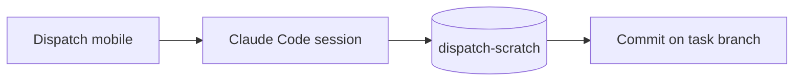

# Rendering test page

A grab bag of Markdown features for checking how Dispatch displays files and diffs.

## Text styles

Plain, **bold**, *italic*, ~~strikethrough~~, `inline code`, and a [link](https://example.com).

> A blockquote.
> It spans two lines.

## Lists

1. Ordered item
2. Another one
   - Nested bullet
   - Second nested bullet

- [x] Completed task
- [ ] Open task

## Table

| Feature            | Tested by                       | Status  |
|--------------------|---------------------------------|---------|
| Code diff          | `textstats.py`                  | ready   |
| Test run output    | `python3 -m unittest -v`        | ready   |
| Markdown rendering | this file                       | ready   |
| Long lines         | the paragraph below             | ready   |

## Code blocks

```python
from textstats import stats
print(stats("hello hello world", top=1))
```

```bash
echo "Dispatch says hi" | python3 textstats.py - --top 3
```

## Diagram



## Long line

This paragraph deliberately runs long without any manual line breaks so you can see whether the viewer wraps text cleanly on a narrow phone screen or scrolls it horizontally instead, which matters a lot for reading diffs on mobile.

## Unicode

Emoji 🚀 ✅ · Accents: café, naïve · CJK: 你好 · Math: ∑ x² ≤ ∞
